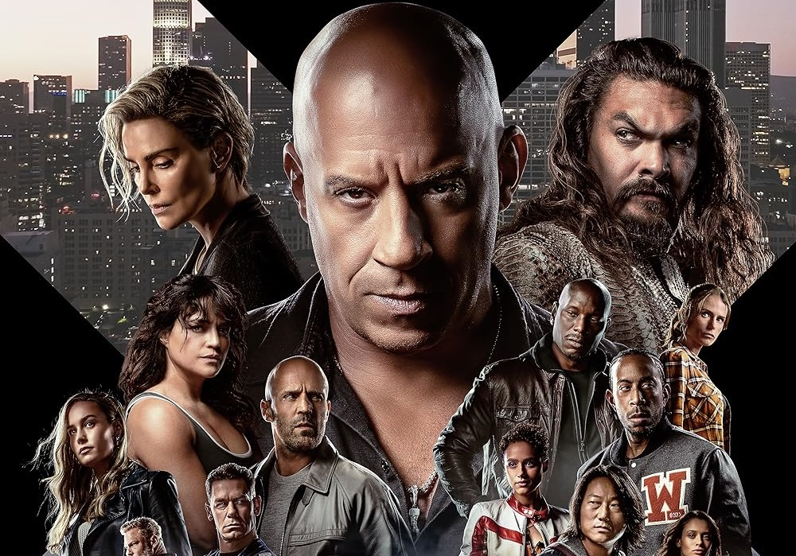

# Fast & Furious X
 

### About
*Fast & Furious*, also known as The Fast and the Furious, is a media franchise centered on a series of action films that are largely concerned with street racing, heists, spies, and family.

- **Created by** Gary Scott Thompson
- **Original work** The Fast and the Furious (2001)
- **Owner** Universal Pictures
- **Years** 2001–present

### Cast

| Real name | Character name |
| ----------- | ----------- |
| Vin Diesel | Dominic Toretto |
| Jason Momoa | Danter Reyes |
| Michelle Rodriquez | Letty |
| Sung Kang | Han Lue |
| Jason Statham | Deckard Shaw |
| John Cena | Jakob Toretto |
| Scott Eastwood | Little Nobody |
| Nathalie Emmanuel | Ramsey |
| Jordana Brewster | Mia |
| Tyrese Gibson | Roman |
| Paul Walker | Brian |
| Ludacris | Tej |

### Other Fast & Furious Released

| Film | U.S. release date |
| ----------- | ----------- |
| The Fast and the Furious | June 22, 2001 |
| 2 Fast 2 Furious | June 6, 2003 |
| The Fast and the Furious: Tokyo Drift | June 16, 2006 |
| Fast & Furious | April 29, 2011 |
| Fast Five | April 29, 2011 |
| Fast & Furious 6 | May 24, 2013 |
| Furious 7 | April 3, 2015 |
| The Fate of the Furious | April 14, 2017 |
| F9 | June 25, 2021 |
| Fast X | May 19, 2023 |

I hope i did it well! :joy:

